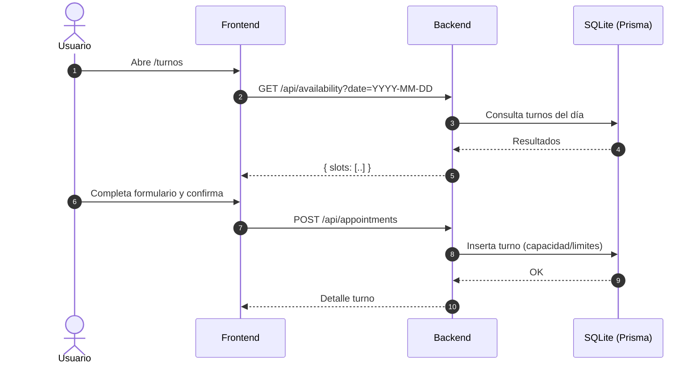

# Turnero Premium – Monorepo

Este proyecto contiene un turnero premium para un lavadero, con backend en Node.js (Express + TypeScript + Prisma/SQLite) y frontend en Vite + React.

- Backend: `backend/` → API, autenticación admin JWT, recordatorios (cron), Twilio opcional
- Frontend: `frontend/` → Sitio público + panel admin

## Requisitos
- Node 18+
- npm

## Estructura
```
backend/
  prisma/
    schema.prisma      # Modelo Prisma (SQLite)
    dev.db             # Base de datos local
  src/
    index.ts           # API + cron + endpoints
    twilio.ts          # Envío WhatsApp (opcional)
  package.json

frontend/
  src/
    pages/             # Vistas (Home, Booking, Admin, etc.)
    components/
    services/api.ts    # Cliente de API
  package.json
```

## Guía rápida (desarrollo)
### 1) Backend
```bash
cd backend
npm install

# Configurar .env
# Si no existe, crear uno con valores similares a:
# PORT=4000
# TIMEZONE=America/Argentina/Buenos_Aires
# JWT_SECRET=super_secreto
# ADMIN_EMAIL=admin@ecolavado.local
# ADMIN_PASSWORD=admin1234
# DATABASE_URL="file:./dev.db"
# TWILIO_ACCOUNT_SID=
# TWILIO_AUTH_TOKEN=
# TWILIO_WHATSAPP_FROM=whatsapp:+14155238886
# REMINDER_WEBHOOK_KEY=alguna_clave_segura

npm run prisma:generate
npm run prisma:push
# opcional
npm run seed

npm run dev   # http://localhost:4000
```

### 2) Frontend
```bash
cd frontend
npm install

# Configurar .env (opcional si usás la URL por defecto)
# VITE_API_URL=http://localhost:4000

npm run dev   # http://localhost:5173
```

> Nota Windows/PowerShell: evitá encadenar comandos con `&&`. Abrí dos terminales o usá `;` por separado.

## Reglas de negocio
- Horas por día: 08:30, 09:30, …, 18:30 (saltos de 60 min, empezando en y30)
- Capacidad: 2 turnos por horario
- Límite: máx 2 turnos por día por número de WhatsApp
- Día actual: oculta horarios de la hora actual hacia atrás
- Recordatorios: cada 5 minutos se marcan como enviados a turnos en los próximos 30 min
- Cierre nocturno: a medianoche marca turnos antiguos como `done`

## Endpoints (resumen)
Base: `http://localhost:4000`

- Salud
  - `GET /health` → `{ ok: true }`

- Disponibilidad pública
  - `GET /api/availability?date=YYYY-MM-DD` → `{ date, slots: string[] }`

- Turnos (público)
  - `POST /api/appointments` → crea turno
  - `GET /api/appointments/cancel/:token` → consulta datos por token
  - `POST /api/appointments/cancel/:token` → cancela por token

- Auth admin (JWT)
  - `POST /api/auth/login` → `{ token }` (ENV o usuarios en DB)

- Admin (Bearer token)
  - `GET /api/admin/appointments` → lista desde hoy
  - `GET /api/admin/appointments?from=ISO&to=ISO` → rango
  - `POST /api/admin/appointments/:id/ready` → marca como `ready`
  - `POST /api/admin/run-reminders` → ejecuta recordatorios manualmente

- Webhook público (cron externo)
  - `GET /api/run-reminders?key=REMINDER_WEBHOOK_KEY`

## Frontend (páginas)
- `/` Home
- `/turnos` Reservar turno
- `/admin` Login admin
- `/admin/turnos` Dashboard (turnos actuales)
- `/admin/historial` Historial
- `/cancelar/:token` Cancelación por enlace

## Diagrama (alto nivel)


## Twilio (WhatsApp)
- Configurar `TWILIO_ACCOUNT_SID`, `TWILIO_AUTH_TOKEN`, `TWILIO_WHATSAPP_FROM`
- Descomentar los envíos reales en `src/index.ts`/`src/twilio.ts` si deseás enviar mensajes en producción

## Tests (backend)
```bash
cd backend
npm test
```

## Build/Deploy
- Backend:
  - Establecer `.env`
  - `npm run build` y `npm start`
  - Ejecutar cron externo contra `GET /api/run-reminders?key=...` (opcional)
- Frontend:
  - Definir `VITE_API_URL`
  - `npm run build` → servir `frontend/dist` estático (Nginx, Vercel, Netlify, etc.)

Para detalles adicionales ver `backend/README.md` y `frontend/README.md`.
